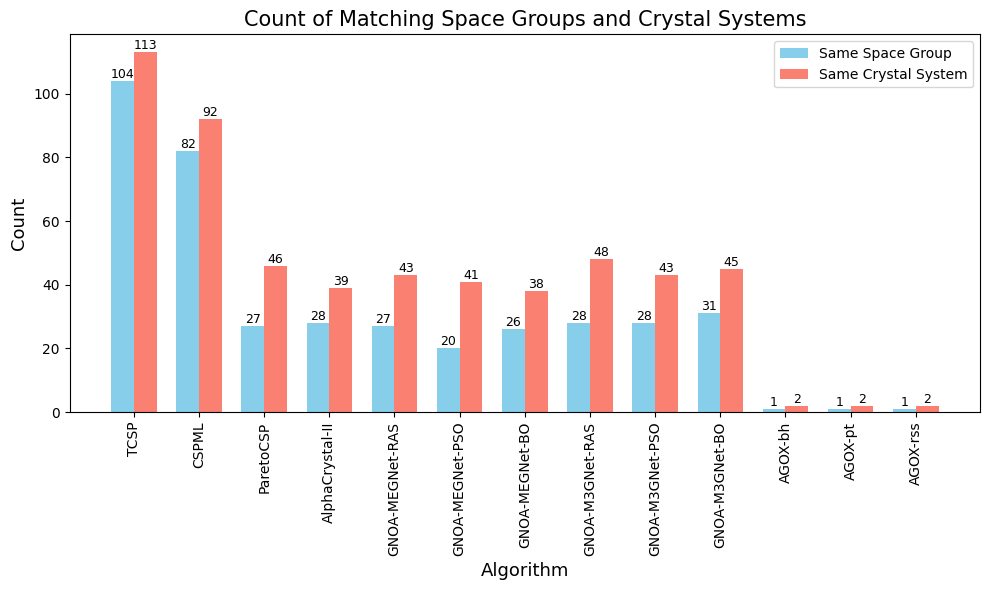
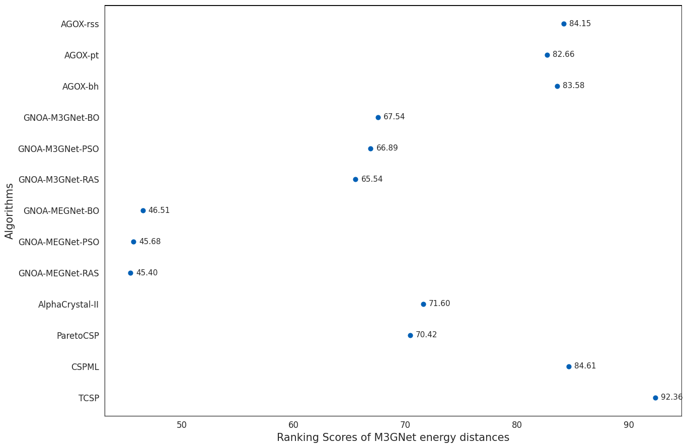
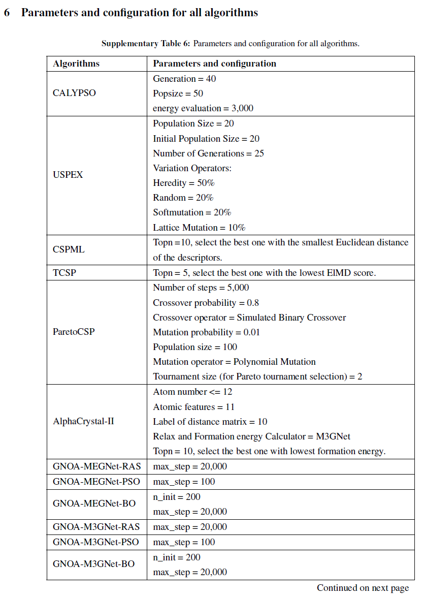
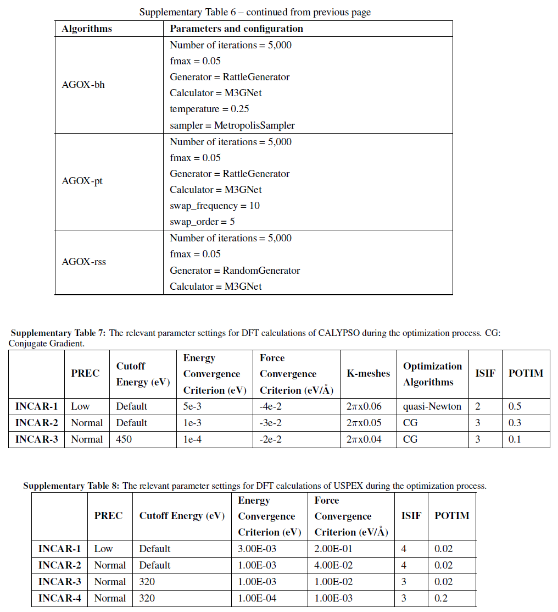

# CSPBenchmark: Benchmark of crystal structure prediction algorithms

Developed by Lai Wei and Dr. Jianjun Hu at <a href="http://mleg.cse.sc.edu" target="_blank">Machine Learning and Evolution Laboratory</a>.

University of South Carolina.

Citing our paper: Wei, Lai, Sadman Sadeed Omee, Rongzhi Dong, Nihang Fu, Yuqi Song, Edirisuriya Siriwardane, Meiling Xu, Chris Wolverton, and Jianjun Hu. "CSPBench: a benchmark and critical evaluation of Crystal Structure Prediction." arXiv preprint arXiv:2407.00733 (2024). [paper](https://arxiv.org/abs/2407.00733)

## A summary of the main CSP softwares. 
MLP: machine learning potentials; MOGA: multi-objective genetic algorithm; \* benchmarked in our study;
  
| Algorithm | Year | Category | Open-source | URL Link | Program Lang |
|-----------|------|----------|-------------|----------|--------------|
| USPEX | 2006 | De novo (DFT) | No | [link](https://uspex-team.org/en/uspex/overview) | Matlab |
| CALYPSO* | 2010 | De novo (DFT) | No | [link](http://www.calypso.cn/) | Python |
| ParetoCSP* | 2024 | MOGA+MLP | Yes | [link](https://github.com/sadmanomee/ParetoCSP) | Python |
| GNOA* | 2022 | BO/PSO + MLP | Yes | [link](http://www.comates.group/links?software=gn_oa) | Python |
| TCSP* | 2022 | Template | Yes | [link](http://materialsatlas.org/crystalstructure) | Python |
| CSPML* | 2022 | Template | Yes | [link](https://github.com/Minoru938/CSPML) | Python |
| GATor | 2018 | GA + FHI potential | Yes | [link](https://www.noamarom.com/software/gator/) | Python |
| AiRss | 2011 | Random + DFT or pair Potential | Yes | [link](https://airss-docs.github.io/) | Fortran |
| GOFEE | 2020 | ActiveLearning + Gaussian Pot. | Yes | [link](http://grendel-www.cscaa.dk/mkb/) | Python |
| AGOX* | 2022 | Search + Gaussian Potential | Yes | [link](https://gitlab.com/agox/agox) | Python |
| GASP | 2007 | GA + DFT | Yes | [link](https://github.com/henniggroup/gasp) | Java |
| M3GNet | 2022 | Relax with MLP | Yes | [link](https://github.com/materialsvirtuallab/m3gnet) | Python |
| ASLA | 2020 | NN + RL | No | [link](https://journals.aps.org/prb/abstract/10.1103/PhysRevB.102.075427) | N/A |
| CrySPY | 2023 | GA/BO + DFT | Yes | [link](https://tomoki-yamashita.github.io/CrySPY_doc/tutorial/random/#running-cryspy) | Python |
| XtalOpt | 2011 | GA + DFT | Yes | [link](http://xtalopt.github.io/download.html) | C++ |
| AlphaCrystal* | 2023 | GA + DL | Yes | [link](https://github.com/usccolumbia/AlphaCrystal) | Python |

## Performance comparison of CSP algorithms over all test structures
We used Crystal Structure Prediction Performance Metrics from <a href="https://github.com/usccolumbia/CSPBenchMetrics" target="_blank">CSPBenchMetrics</a>.

Ranking scores calculation code are shwon in the code folder <a href="https://github.com/usccolumbia/cspbenchmark/blob/main/code/compute_ranking_scores.ipynb" target="_blank">Compute-Ranking-Scores</a>.

## Metric distances of CSPML, ParetoCSP, AGOX-pt, and CALYPSO algorithms
(ED: M3GNet Energy Distance (eV), HD: Hausdorff Distance (Å). Values highlighted in bold represent the minimum ED or HD computed from the predicted and ground truth structures for each test sample across various algorithms.)
| Algorithm          |                  | CALYPSO |        |  USPEX |        |  CSPML  |        | ParetoCSP |        |  AGOX-rss |        |
|--------------------|------------------|---------|--------|--------|--------|---------|--------|-----------|--------|-----------|--------|
| Primitive Formula  | Material ID      | ED      | HD     | ED     | HD     | ED      | HD     | ED        | HD     | ED        | HD     |
| Ca3SnO             | mp-29241         | 0.002   | 2.413  | 0.010  | 6.242  | 0.001   | 0.021  | 0.001     | 0.025  | 1.271     | 10.189 |
| Co2Ni2Sn2          | mp-20237         | 0.061   | 5.489  | 0.024  | 5.313  | 0.000   | 2.557  | 0.154     | 4.670  | 1.112     | 19.763 |
| Co2Te2             | mp-788           | 0.028   | 6.520  | 0.015  | 6.927  | 0.220   | 2.475  | 0.041     | 5.725  | 0.879     | 6.474  |
| Cr6Ga2             | mp-1231          | 2.016   | 7.001  | 0.044  | 5.418  | 0.096   | 5.710  | 0.015     | 1.622  | 1.427     | 7.770  |
| Hf4Mn8             | mp-11449         | 0.002   | 6.383  | 0.002  | 7.558  | 0.129   | 8.715  | 0.000     | 6.015  | 1.628     | 14.092 |
| Hf4Ni2             | mp-861           | 0.014   | 4.064  | 0.000  | 6.626  | 1.274   | 11.162 | 0.039     | 7.346  | 1.716     | 6.561  |
| HfCo2Sn            | mp-20730         | 0.054   | 3.928  | 0.000  | 8.074  | 0.002   | 0.046  | 0.002     | 0.043  | 2.175     | 20.064 |
| InHg               | mp-20132         | 0.012   | 10.296 | 0.013  | 4.743  | 0.015   | 7.968  | 0.062     | 6.585  | 0.191     | 15.757 |
| Li2CuSn            | mp-30591         | 0.004   | 3.933  | 0.005  | 11.085 | 0.111   | 0.129  | 0.007     | 0.155  | 0.818     | 13.590 |
| LiMg2Ga            | mp-30648         | 0.031   | 7.062  | 0.005  | 12.723 | 0.000   | 2.892  | 0.000     | 0.030  | 0.762     | 22.893 |
| MgCu4Sn            | mp-3676          | 0.006   | 3.194  | 0.005  | 8.914  | 0.167   | 5.256  | 0.298     | 10.131 | 0.989     | 12.358 |
| MgInCu4            | mp-30587         | 0.070   | 4.861  | 0.007  | 10.618 | 0.010   | 1.704  | 0.294     | 9.063  | 0.951     | 19.267 |
| NaGa4              | mp-454           | 0.021   | 2.473  | 0.015  | 2.630  | 0.388   | 5.206  | 0.034     | 7.260  | 0.298     | 17.157 |
| ScCu               | mp-1169          | 0.004   | 1.701  | 0.000  | 2.818  | 0.108   | 3.681  | 0.000     | 0.005  | 2.695     | 11.480 |
| SrGa4              | mp-1827          | 0.003   | 2.685  | 0.002  | 2.221  | 0.722   | 6.777  | 0.011     | 7.378  | 0.481     | 9.839  |
| SrGaCu2            | mp-30580         | 0.000   | 8.402  | 0.003  | 11.319 | 0.196   | 4.749  | 0.069     | 14.710 | 1.024     | 22.613 |
| Ti2Cd              | mp-30501         | 0.041   | 3.755  | 0.008  | 6.555  | 0.061   | 1.064  | 0.088     | 6.806  | 2.497     | 10.532 |
| TiGa3              | mp-2731          | 0.023   | 2.348  | 0.006  | 3.605  | 0.006   | 8.246  | 0.003     | 2.647  | 1.373     | 11.640 |
| Y3Al9              | mp-2451,mp-11231 | 0.001   | 0.011  | 0.006  | 9.119  | 0.002   | 3.022  | N/A       | N/A    | 0.875     | 10.302 |
| YHg2               | mp-30725         | 0.001   | 1.747  | 0.081  | 5.079  | 0.006   | 0.044  | 0.006     | 1.747  | 1.025     | 5.930  |
| Zn2C2O6            | mp-9812          | 0.054   | 10.398 | 0.196  | 9.430  | 0.008   | 3.995  | N/A       | N/A    | 0.582     | 11.607 |
| ZnCdPt2            | mp-30493         | 0.008   | 0.134  | 0.009  | 7.511  | 0.086   | 8.328  | 0.048     | 2.487  | 1.236     | 13.624 |
| ZrHg               | mp-2510          | 0.010   | 4.172  | 0.003  | 5.745  | 0.004   | 0.463  | 0.016     | 5.699  | 1.848     | 14.363 |
| # of Best          |                  | 7       | 6      | 8      | 2      | 5       | 12     | 5         | 3      | 0          | 0     |

## Parameters and configuration for all algorithms.

## Details of the 180 benchmark crystals used in this work
You can download the whold test data in data/CSPbenchmark_test_data.csv

| material_id | primitive_formula | full_formula | pretty_formula | nsites | spacegroup | nelements | elements_list | CrystalSystem | category      |
|-------------|-------------------|--------------|----------------|--------|------------|-----------|---------------|---------------|---------------|
| mp-2334     | DyCu              | DyCu         | DyCu           |      2 |        221 |         2 | Cu Dy         | Cubic         | binary_easy   |
| mp-2226     | DyPd              | DyPd         | DyPd           |      2 |        221 |         2 | Dy Pd         | Cubic         | binary_easy   |
| mp-1121     | GaCo              | GaCo         | GaCo           |      2 |        221 |         2 | Co Ga         | Cubic         | binary_easy   |
| mp-2735     | PaO               | Pa4O4        | PaO            |      2 |        225 |         2 | O Pa          | Cubic         | binary_easy   |
| mp-1169     | ScCu              | ScCu         | ScCu           |      2 |        221 |         2 | Cu Sc         | Cubic         | binary_easy   |
| mp-30746    | YIr               | YIr          | YIr            |      2 |        221 |         2 | Ir Y          | Cubic         | binary_easy   |
| mp-24658    | SmH2              | Sm4H8        | SmH2           |      3 |        225 |         2 | H Sm          | Cubic         | binary_easy   |
| mp-20225    | CePb3             | CePb3        | CePb3          |      4 |        221 |         2 | Ce Pb         | Cubic         | binary_easy   |
| mp-788      | Co2Te2            | Co2Te2       | CoTe           |      4 |        194 |         2 | Co Te         | Hexagonal     | binary_easy   |
| mp-20176    | DyPb3             | DyPb3        | DyPb3          |      4 |        221 |         2 | Dy Pb         | Cubic         | binary_easy   |
| mp-1231     | Cr6Ga2            | Cr6Ga2       | Cr3Ga          |      8 |        223 |         2 | Cr Ga         | Cubic         | binary_easy   |
| mp-12570    | ThB12             | Th4B48       | ThB12          |     13 |        225 |         2 | B Th          | Cubic         | binary_easy   |
| mp-20132    | InHg              | In3Hg3       | InHg           |      2 |        166 |         2 | Hg In         | Trigonal      | binary_medium |
| mp-2209     | CeGa2             | CeGa2        | CeGa2          |      3 |        191 |         2 | Ce Ga         | Hexagonal     | binary_medium |
| mp-30497    | TbCd2             | TbCd2        | TbCd2          |      3 |        191 |         2 | Cd Tb         | Hexagonal     | binary_medium |
| mp-30725    | YHg2              | YHg2         | YHg2           |      3 |        191 |         2 | Hg Y          | Hexagonal     | binary_medium |
| mp-2731     | TiGa3             | Ti2Ga6       | TiGa3          |      4 |        139 |         2 | Ga Ti         | Tetragonal    | binary_medium |
| mp-2510     | ZrHg              | ZrHg         | ZrHg           |      4 |        123 |         2 | Hg Zr         | Tetragonal    | binary_medium |
| mp-2740     | ErCo5             | ErCo5        | ErCo5          |      6 |        191 |         2 | Co Er         | Hexagonal     | binary_medium |
| mp-570875   | Ga4Os2            | Ga16Os8      | Ga2Os          |      6 |         70 |         2 | Ga Os         | Orthorhombic  | binary_medium |
| mp-861      | Hf4Ni2            | Hf8Ni4       | Hf2Ni          |      6 |        140 |         2 | Hf Ni         | Tetragonal    | binary_medium |
| mp-1566     | SmFe5             | SmFe5        | SmFe5          |      6 |        191 |         2 | Fe Sm         | Hexagonal     | binary_medium |
| mp-2387     | Th4Zn2            | Th8Zn4       | Th2Zn          |      6 |        140 |         2 | Th Zn         | Tetragonal    | binary_medium |
| mp-1607     | YbCu5             | YbCu5        | YbCu5          |      6 |        191 |         2 | Cu Yb         | Hexagonal     | binary_medium |
| mp-13452    | BePd2             | Be2Pd4       | BePd2          |      3 |        139 |         2 | Be Pd         | Tetragonal    | binary_hard   |
| mp-11359    | Ga2Cu             | Ga2Cu        | Ga2Cu          |      3 |        123 |         2 | Cu Ga         | Tetragonal    | binary_hard   |
| mp-1995     | PrC2              | Pr2C4        | PrC2           |      3 |        139 |         2 | C Pr          | Tetragonal    | binary_hard   |
| mp-30501    | Ti2Cd             | Ti4Cd2       | Ti2Cd          |      3 |        139 |         2 | Cd Ti         | Tetragonal    | binary_hard   |
| mp-30789    | U2Mo              | U4Mo2        | U2Mo           |      3 |        139 |         2 | Mo U          | Tetragonal    | binary_hard   |
| mp-454      | NaGa4             | Na2Ga8       | NaGa4          |      5 |        139 |         2 | Ga Na         | Tetragonal    | binary_hard   |
| mp-1827     | SrGa4             | Sr2Ga8       | SrGa4          |      5 |        139 |         2 | Ga Sr         | Tetragonal    | binary_hard   |
| mp-2129     | Nd2Ge4            | Nd4Ge8       | NdGe2          |      6 |        141 |         2 | Ge Nd         | Tetragonal    | binary_hard   |
| mp-30682    | ZrGa              | Zr8Ga8       | ZrGa           |      8 |        141 |         2 | Ga Zr         | Tetragonal    | binary_hard   |
| mp-2128     | Sn8Pd2            | Sn16Pd4      | Sn4Pd          |     10 |         68 |         2 | Pd Sn         | Orthorhombic  | binary_hard   |
| mp-1208467  | Tb8Al2            | Tb32Al8      | Tb4Al          |     10 |        227 |         2 | Al Tb         | Cubic         | binary_hard   |
| mp-640079   | Mn9Au3            | Mn9Au3       | Mn3Au          |     12 |        123 |         2 | Au Mn         | Tetragonal    | binary_hard   |
| mp-5452     | CeCu2Si2          | 5               | 139        | Tetragonal    | ternary_medium            |
| mp-3147     | ErSi2Au2          | 5               | 139        | Tetragonal    | ternary_medium            |
| mp-13405    | LuMn2Ge2          | 5               | 139        | Tetragonal    | ternary_medium            |
| mp-30805    | SrNiSn3           | 5               | 107        | Tetragonal    | ternary_medium            |
| mp-5615     | Ca3Ag3As3         | 9               | 189        | Hexagonal     | ternary_medium            |
| mp-30733    | Ho3Sn3Pt3         | 9               | 189        | Hexagonal     | ternary_medium            |
| mp-16747    | Lu3Ag3Pb3         | 9               | 189        | Hexagonal     | ternary_medium            |
| mp-9812     | Zn2C2O6           | 10              | 167        | Trigonal      | ternary_medium            |
## 
