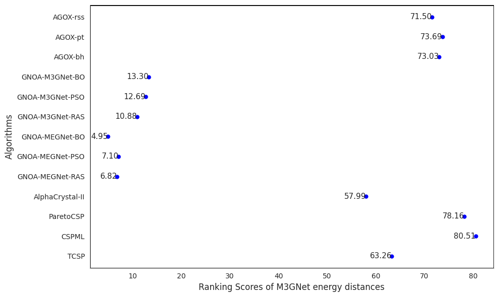

# CSPBenchmark: Benchmark of crystal structure prediction algorithms

Developed by Lai Wei and Dr. Jianjun Hu at <a href="http://mleg.cse.sc.edu" target="_blank">Machine Learning and Evolution Laboratory</a>.

University of South Carolina.

Citing our paper: Wei, Lai, Sadman Sadeed Omee, Rongzhi Dong, Nihang Fu, Yuqi Song, Edirisuriya Siriwardane, Meiling Xu, Chris Wolverton, and Jianjun Hu. "CSPBench: a benchmark and critical evaluation of Crystal Structure Prediction." arXiv preprint arXiv:2407.00733 (2024). [paper](https://arxiv.org/abs/2407.00733)

## A summary of the main CSP softwares. 
MLP: machine learning potentials; MOGA: multi-objective genetic algorithm; \* benchmarked in our study;
  
| Algorithm | Year | Category | Open-source | URL Link | Program Lang |
|-----------|------|----------|-------------|----------|--------------|
| USPEX | 2006 | De novo (DFT) | No | [link](https://uspex-team.org/en/uspex/overview) | Matlab |
| CALYPSO* | 2010 | De novo (DFT) | No | [link](http://www.calypso.cn/) | Python |
| ParetoCSP* | 2024 | MOGA+MLP | Yes | [link](https://github.com/sadmanomee/ParetoCSP) | Python |
| GNOA* | 2022 | BO/PSO + MLP | Yes | [link](http://www.comates.group/links?software=gn_oa) | Python |
| TCSP* | 2022 | Template | Yes | [link](http://materialsatlas.org/crystalstructure) | Python |
| CSPML* | 2022 | Template | Yes | [link](https://github.com/Minoru938/CSPML) | Python |
| GATor | 2018 | GA + FHI potential | Yes | [link](https://www.noamarom.com/software/gator/) | Python |
| AiRss | 2011 | Random + DFT or pair Potential | Yes | [link](https://airss-docs.github.io/) | Fortran |
| GOFEE | 2020 | ActiveLearning + Gaussian Pot. | Yes | [link](http://grendel-www.cscaa.dk/mkb/) | Python |
| AGOX* | 2022 | Search + Gaussian Potential | Yes | [link](https://gitlab.com/agox/agox) | Python |
| GASP | 2007 | GA + DFT | Yes | [link](https://github.com/henniggroup/gasp) | Java |
| M3GNet | 2022 | Relax with MLP | Yes | [link](https://github.com/materialsvirtuallab/m3gnet) | Python |
| ASLA | 2020 | NN + RL | No | [link](https://journals.aps.org/prb/abstract/10.1103/PhysRevB.102.075427) | N/A |
| CrySPY | 2023 | GA/BO + DFT | Yes | [link](https://tomoki-yamashita.github.io/CrySPY_doc/tutorial/random/#running-cryspy) | Python |
| XtalOpt | 2011 | GA + DFT | Yes | [link](http://xtalopt.github.io/download.html) | C++ |
| AlphaCrystal* | 2023 | GA + DL | Yes | [link](https://github.com/usccolumbia/AlphaCrystal) | Python |

## Performance comparison of CSP algorithms over all test structures
We used Crystal Structure Prediction Performance Metrics from <a href="https://github.com/usccolumbia/CSPBenchMetrics" target="_blank">CSPBenchMetrics</a>.

Ranking scores calculation code are shwon in the code folder <a href="https://github.com/usccolumbia/cspbenchmark/blob/main/code/compute_ranking_scores.ipynb" target="_blank">Compute-Ranking-Scores</a>.

## Metric distances of CSPML, ParetoCSP, AGOX-pt, and CALYPSO algorithms
(ED: M3GNet Energy Distance (eV), HD: Hausdorff Distance (Å). Values highlighted in bold represent the minimum ED or HD computed from the predicted and ground truth structures for each test sample across various algorithms.)
| Algorithm   | CSPML  |       | ParetoCSP |       | AGOX-pt |       | CALYPSO |       |
|-------------|--------|-------|-----------|-------|---------|-------|---------|-------|
| Test Sample | ED     | HD    | ED        | HD    | ED      | HD    | ED      | HD    |
| Ca3SnO   | 0.01   | 0.02  | 0.01      | 0.02  | 5.50    | 9.34  | 0.01    | 2.41  |
| CoNiSn      | 34.15  | 4.33  | 0.01      | 0.06  | 7.26    | 7.30  | 34.55   | 6.68  |
| CoTe        | 0.18   | 1.52  | 0.20      | 2.33  | 6.88    | 9.90  | 0.11    | 2.38  |
| Cr3Ga    | 31.78  | 2.79  | 0.12      | 1.62  | 11.95   | 6.62  | 16.13   | 4.07  |
| Hf2Ni    | 0.05   | 5.58  | 52.93     | 3.40  | 10.94   | 8.03  | 0.09    | 4.18  |
| HfCo2Sn  | 0.01   | 0.04  | 0.15      | 5.29  | 5.18    | 8.88  | 29.31   | 3.46  |
| HfMn2    | 0.03   | 0.15  | 59.73     | 5.53  | 19.92   | 7.21  | 116.21  | 5.04  |
| InHg        | 22.54  | 8.61  | 0.14      | 6.05  | 0.38    | 7.13  | 0.02    | 4.51  |
| Li2CuSn  | 0.44   | 0.12  | 0.05      | 5.51  | 2.82    | 8.76  | 13.14   | 3.54  |
| LiMg2Ga  | 0.00   | 0.03  | 0.13      | 4.48  | 8.70    | 8.87  | 8.60    | 5.33  |
| MgCu4Sn  | 0.04   | 0.09  | 0.51      | 2.74  | 5.65    | 8.83  | 67.92   | 5.34  |
| MgInCu4  | 0.06   | 3.07  | 0.47      | 3.69  | 5.92    | 9.65  | 20.48   | 7.26  |
| NaGa4    | 0.05   | 5.22  | 0.05      | 2.10  | 3.52    | 7.42  | 0.10    | 2.24  |
| ScCu        | 0.00   | 0.01  | 0.00      | 0.01  | 5.39    | 11.77 | 0.01    | 1.70  |
| SrGa4    | 0.02   | 5.43  | 0.05      | 2.27  | 4.10    | 9.97  | 15.76   | 6.41  |
| SrGaCu2  | 0.78   | 4.79  | 0.30      | 9.45  | 3.27    | 8.55  | 13.91   | 10.39 |
| Ti2Cd    | 16.18  | 2.04  | 0.03      | 1.46  | 7.49    | 9.34  | 16.66   | 3.57  |
| TiGa3    | 0.02   | 2.44  | 0.01      | 1.50  | 1.48    | 9.60  | 0.09    | 2.67  |
| YAl3     | 19.39  | 11.76 | 1.41      | 12.24 | 10.72   | 9.55  | 38.98   | 13.77 |
| YHg2     | 8.41   | 5.83  | 0.02      | 1.74  | 3.07    | 8.98  | 0.00    | 1.75  |
| ZnCdPt2  | 0.29   | 2.99  | 0.04      | 2.04  | 4.85    | 8.63  | 0.03    | 0.13  |
| ZnCO3    | 0.08   | 1.31  | 8.88      | 4.71  | 6.79    | 8.53  | 0.54    | 4.06  |
| ZrHg        | 9.16   | 2.69  | 0.06      | 2.15  | 3.09    | 9.45  | 9.21    | 2.30  |
| # of Best   | 12     | 11    | 10        | 8     | 1       | 2     | 5       | 3     |

## Parameters and configuration for all algorithms.

## Details of the 180 benchmark crystals used in this work
You can download test data in data/CSPbenchmark_test_data.csv

| Material id | Primitive formula | Number of sites | Spacegroup | CrystalSystem | Category                  |
|-------------|-------------------|-----------------|------------|---------------|---------------------------|
| mp-2334     | DyCu              | 2               | 221        | Cubic         | binary_easy               |
| mp-2226     | DyPd              | 2               | 221        | Cubic         | binary_easy               |
| mp-1121     | GaCo              | 2               | 221        | Cubic         | binary_easy               |
| mp-2735     | PaO               | 2               | 225        | Cubic         | binary_easy               |
| mp-1169     | ScCu              | 2               | 221        | Cubic         | binary_easy               |
| mp-30746    | YIr               | 2               | 221        | Cubic         | binary_easy               |
| mp-24658    | SmH2              | 3               | 225        | Cubic         | binary_easy               |
| mp-20225    | CePb3             | 4               | 221        | Cubic         | binary_easy               |
| mp-788      | Co2Te2            | 4               | 194        | Hexagonal     | binary_easy               |
| mp-20176    | DyPb3             | 4               | 221        | Cubic         | binary_easy               |
| mp-1231     | Cr6Ga2            | 8               | 223        | Cubic         | binary_easy               |
| mp-12570    | ThB12             | 13              | 225        | Cubic         | binary_easy               |
| mp-13452    | BePd2             | 3               | 139        | Tetragonal    | binary_hard               |
| mp-11359    | Ga2Cu             | 3               | 123        | Tetragonal    | binary_hard               |
| mp-1995     | PrC2              | 3               | 139        | Tetragonal    | binary_hard               |
| mp-30501    | Ti2Cd             | 3               | 139        | Tetragonal    | binary_hard               |
| mp-30789    | U2Mo              | 3               | 139        | Tetragonal    | binary_hard               |
| mp-454      | NaGa4             | 5               | 139        | Tetragonal    | binary_hard               |
| mp-1827     | SrGa4             | 5               | 139        | Tetragonal    | binary_hard               |
| mp-2129     | Nd2Ge4            | 6               | 141        | Tetragonal    | binary_hard               |
| mp-30682    | ZrGa              | 8               | 141        | Tetragonal    | binary_hard               |
| mp-2128     | Sn8Pd2            | 10              | 68         | Orthorhombic  | binary_hard               |
| mp-1208467  | Tb8Al2            | 10              | 227        | Cubic         | binary_hard               |
| mp-640079   | Mn9Au3            | 12              | 123        | Tetragonal    | binary_hard               |
| mp-20132    | InHg              | 2               | 166        | Trigonal      | binary_medium             |
| mp-2209     | CeGa2             | 3               | 191        | Hexagonal     | binary_medium             |
| mp-30497    | TbCd2             | 3               | 191        | Hexagonal     | binary_medium             |
| mp-30725    | YHg2              | 3               | 191        | Hexagonal     | binary_medium             |
| mp-2731     | TiGa3             | 4               | 139        | Tetragonal    | binary_medium             |
| mp-2510     | ZrHg              | 4               | 123        | Tetragonal    | binary_medium             |
| mp-2740     | ErCo5             | 6               | 191        | Hexagonal     | binary_medium             |
| mp-570875   | Ga4Os2            | 6               | 70         | Orthorhombic  | binary_medium             |
| mp-861      | Hf4Ni2            | 6               | 140        | Tetragonal    | binary_medium             |
| mp-1566     | SmFe5             | 6               | 191        | Hexagonal     | binary_medium             |
| mp-2387     | Th4Zn2            | 6               | 140        | Tetragonal    | binary_medium             |
| mp-1607     | YbCu5             | 6               | 191        | Hexagonal     | binary_medium             |
| mp-8882     | Ga2P2             | 4               | 186        | Hexagonal     | polymorph_binary          |
| mp-13181    | LaF3              | 4               | 225        | Cubic         | polymorph_binary          |
| mp-568382   | Mn2Bi2            | 4               | 194        | Hexagonal     | polymorph_binary          |
| mp-1004     | Nb3Si             | 4               | 221        | Cubic         | polymorph_binary          |
| mp-2067     | Th2Ga4            | 6               | 141        | Tetragonal    | polymorph_binary          |
| mp-2178     | Yb2Ga4            | 6               | 194        | Hexagonal     | polymorph_binary          |
| mp-11251    | Mg6Au2            | 8               | 194        | Hexagonal     | polymorph_binary          |
| mp-9761     | Re2O6             | 8               | 182        | Hexagonal     | polymorph_binary          |
| mp-2231     | Sn4S4             | 8               | 62         | Orthorhombic  | polymorph_binary          |
| mp-11449    | Hf4Mn8            | 12              | 194        | Hexagonal     | polymorph_binary          |
| mp-2451     | Y3Al9             | 12              | 166        | Trigonal      | polymorph_binary          |
| mp-476      | Ge6N8             | 14              | 227        | Cubic         | polymorph_binary          |
| mp-23127    | Ba2BiSbO6         | 10              | 12         | Monoclinic    | polymorph_quartenary      |
| mp-10731    | Ba2PrSbO6         | 10              | 225        | Cubic         | polymorph_quartenary      |
| mp-9349     | KRb2ScF6          | 10              | 225        | Cubic         | polymorph_quartenary      |
| mp-1080753  | NaPb2IO6          | 10              | 225        | Cubic         | polymorph_quartenary      |
| mp-550722   | Ba2Tl2CuO6        | 11              | 139        | Tetragonal    | polymorph_quartenary      |
| mp-6628     | CsCdN3O6          | 11              | 146        | Trigonal      | polymorph_quartenary      |
| mp-1095437  | Lu2Se2O6F2        | 12              | 11         | Monoclinic    | polymorph_quartenary      |
| mp-726253   | RbLi3S2O9         | 15              | 1          | Triclinic     | polymorph_quartenary      |
| mp-23667    | Rb2P2H4O8         | 16              | 43         | Orthorhombic  | polymorph_quartenary      |
| mp-2233097  | MgV4SnO12         | 18              | 5          | Monoclinic    | polymorph_quartenary      |
| mp-1105110  | Sr4Bi4Se6O4       | 18              | 14         | Monoclinic    | polymorph_quartenary      |
| mp-23125    | K6Na2Fe2Cl12      | 22              | 167        | Trigonal      | polymorph_quartenary      |
| c           | Li2NiO2           | 5               | 71         | Orthorhombic  | polymorph_ternary         |
| mp-13171    | Y3Mg3Cu3          | 9               | 189        | Hexagonal     | polymorph_ternary         |
| mp-19227    | Y2Mn2O6           | 10              | 194        | Hexagonal     | polymorph_ternary         |
| mp-7550     | Ce2Nb2O8          | 12              | 15         | Monoclinic    | polymorph_ternary         |
| mp-11658    | Cu4Sn2Se6         | 12              | 9          | Monoclinic    | polymorph_ternary         |
| mp-23550    | K2Br2F8           | 12              | 140        | Tetragonal    | polymorph_ternary         |
| mp-12931    | Sm2Ta2O8          | 12              | 13         | Monoclinic    | polymorph_ternary         |
| mp-19418    | V2Cr2O8           | 12              | 63         | Orthorhombic  | polymorph_ternary         |
| mp-7913     | Be4Si4N8          | 16              | 33         | Orthorhombic  | polymorph_ternary         |
| mp-557997   | Ca4Se4O12         | 20              | 14         | Monoclinic    | polymorph_ternary         |
| mp-27450    | K4Cu4Cl12         | 20              | 14         | Monoclinic    | polymorph_ternary         |
| mp-5126     | Zn4S4O16          | 24              | 62         | Orthorhombic  | polymorph_ternary         |
| mp-545788   | Ba3ZnN2O          | 7               | 123        | Tetragonal    | quartenary_hard           |
| mp-18745    | La2Mn2Sb2O2       | 8               | 129        | Tetragonal    | quartenary_hard           |
| mp-12515    | La2Zn2Sb2O2       | 8               | 129        | Tetragonal    | quartenary_hard           |
| mp-20349    | Sm2Fe2As2O2       | 8               | 129        | Tetragonal    | quartenary_hard           |
| mp-19118    | BaNd2CoO5         | 9               | 71         | Orthorhombic  | quartenary_hard           |
| mp-21348    | Ba2EuTaO6         | 10              | 87         | Tetragonal    | quartenary_hard           |
| mp-13356    | Ba2SrTeO6         | 10              | 148        | Trigonal      | quartenary_hard           |
| mp-9666     | K4Na2Ga2P4        | 12              | 72         | Orthorhombic  | quartenary_hard           |
| mp-23126    | KAs4IO6           | 12              | 191        | Hexagonal     | quartenary_hard           |
| mp-14466    | KLi6IrO6          | 14              | 166        | Trigonal      | quartenary_hard           |
| mp-651268   | Fe2Cu6SnS8        | 17              | 115        | Tetragonal    | quartenary_hard           |
| mp-13383    | Sc2Ag2P4Se12      | 20              | 163        | Trigonal      | quartenary_hard           |
| mp-6258     | CeCr2Si2C         | 6               | 123        | Tetragonal    | quartenary_medium         |
| mp-6794     | LaB2Rh2C          | 6               | 139        | Tetragonal    | quartenary_medium         |
| mp-6140     | PrNi2B2C          | 6               | 139        | Tetragonal    | quartenary_medium         |
| mp-546790   | La2Cu2Te2O2       | 8               | 129        | Tetragonal    | quartenary_medium         |
| mp-20807    | Sr2Fe2As2F2       | 8               | 129        | Tetragonal    | quartenary_medium         |
| mp-6231     | Ba2ErSbO6         | 10              | 225        | Cubic         | quartenary_medium         |
| mp-19751    | Ba2YbNbO6         | 10              | 225        | Cubic         | quartenary_medium         |
| mp-15888    | Ba2YIrO6          | 10              | 225        | Cubic         | quartenary_medium         |
| mp-6428     | Ba2YRuO6          | 10              | 225        | Cubic         | quartenary_medium         |
| mp-19274    | BaPrMn2O6         | 10              | 123        | Tetragonal    | quartenary_medium         |
| mp-6586     | K2NaAlF6          | 10              | 225        | Cubic         | quartenary_medium         |
| mp-24412    | K2NaAlH6          | 10              | 225        | Cubic         | quartenary_medium         |
| mp-1213726  | CrFeCoSi          | 4               | 216        | Cubic         | quaternary_easy           |
| mp-7554     | LiMgSnAu          | 4               | 216        | Cubic         | quaternary_easy           |
| mp-11806    | LiMgSnPt          | 4               | 216        | Cubic         | quaternary_easy           |
| mp-552674   | ZrTaNO            | 4               | 187        | Hexagonal     | quaternary_easy           |
| mp-1071272  | CeAl2BRu2         | 6               | 123        | Tetragonal    | quaternary_easy           |
| mp-13287    | Ba2Cu2Te2F2       | 8               | 129        | Tetragonal    | quaternary_easy           |
| mp-12444    | Sr2Cu2S2F2        | 8               | 129        | Tetragonal    | quaternary_easy           |
| mp-19093    | Ba2UNiO6          | 10              | 225        | Cubic         | quaternary_easy           |
| mp-1111671  | K2LiInF6          | 10              | 225        | Cubic         | quaternary_easy           |
| mp-6686     | K2NaInF6          | 10              | 225        | Cubic         | quaternary_easy           |
| mp-16307    | Sr2MgIrO6         | 10              | 225        | Cubic         | quaternary_easy           |
| mp-9705     | Ba4NaB3N6         | 14              | 229        | Cubic         | quaternary_easy           |
| mp-1071835  | Dy2Cu4            | 6               | 74         | Orthorhombic  | template-based_binary     |
| mp-1102067  | Pu4Sn8            | 12              | 141        | Tetragonal    | template-based_binary     |
| mp-1102049  | Ta3Be9            | 12              | 166        | Trigonal      | template-based_binary     |
| mp-1102936  | Ta8Fe4            | 12              | 193        | Hexagonal     | template-based_binary     |
| mp-1095641  | Tb5S7             | 12              | 12         | Monoclinic    | template-based_binary     |
| mp-1103888  | YbB12             | 13              | 225        | Cubic         | template-based_binary     |
| mp-1105001  | Tm6Pt8            | 14              | 148        | Trigonal      | template-based_binary     |
| mp-1104457  | Eu9Au6            | 15              | 148        | Trigonal      | template-based_binary     |
| mp-1104286  | Ge12Rh3           | 15              | 152        | Trigonal      | template-based_binary     |
| mp-1106395  | Pr12Ir4           | 16              | 62         | Orthorhombic  | template-based_binary     |
| mp-1105958  | Yb12Co4           | 16              | 62         | Orthorhombic  | template-based_binary     |
| mp-1190213  | Re4B16            | 20              | 194        | Hexagonal     | template-based_binary     |
| mp-1111927  | K2LiCrF6          | 10              | 225        | Cubic         | template-based_quartenary |
| mp-1104454  | Ta4GaTe4Se4       | 13              | 216        | Cubic         | template-based_quartenary |
| mp-1106310  | Cu4Si2Hg2S8       | 16              | 31         | Orthorhombic  | template-based_quartenary |
| mp-1105386  | Yb2H6C2N6         | 16              | 176        | Hexagonal     | template-based_quartenary |
| mp-1106402  | Rb4Ti2O2F10       | 18              | 63         | Orthorhombic  | template-based_quartenary |
| mp-1106325  | CaCu3Pt4O12       | 20              | 204        | Cubic         | template-based_quartenary |
| mp-1106150  | CeMn4Cu3O12       | 20              | 204        | Cubic         | template-based_quartenary |
| mp-1106004  | HoFe4Cu3O12       | 20              | 204        | Cubic         | template-based_quartenary |
| mp-1106068  | LaCr4Cu3O12       | 20              | 204        | Cubic         | template-based_quartenary |
| mp-1105674  | Mg4Be2B4Ir10      | 20              | 127        | Tetragonal    | template-based_quartenary |
| mp-1105109  | PrCu3Ru4O12       | 20              | 204        | Cubic         | template-based_quartenary |
| mp-1105290  | Co3Sb4O6F6        | 38              | 217        | Cubic         | template-based_quartenary |
| mp-1114630  | Rb3PrCl6          | 10              | 225        | Cubic         | template-based_ternary    |
| mp-1105802  | Ca4Ge8Pt4         | 16              | 71         | Orthorhombic  | template-based_ternary    |
| mp-1106406  | Ce4Sn2S10         | 16              | 55         | Orthorhombic  | template-based_ternary    |
| mp-1106349  | Sm2Pd6S8          | 16              | 223        | Cubic         | template-based_ternary    |
| mp-1106327  | Co4NiSb12         | 17              | 204        | Cubic         | template-based_ternary    |
| mp-1106064  | Ho4Ga12Ni         | 17              | 229        | Cubic         | template-based_ternary    |
| mp-1106196  | Lu4Ga12Ni         | 17              | 229        | Cubic         | template-based_ternary    |
| mp-1106117  | La10Ag2Pb6        | 18              | 193        | Hexagonal     | template-based_ternary    |
| mp-1106245  | Zr10Al2Sb6        | 18              | 193        | Hexagonal     | template-based_ternary    |
| mp-1105955  | Er6Cu6Sb8         | 20              | 220        | Cubic         | template-based_ternary    |
| mp-1105893  | La6Cu6Bi8         | 20              | 220        | Cubic         | template-based_ternary    |
| mp-1105777  | U6Sb8Ir6          | 20              | 220        | Cubic         | template-based_ternary    |
| mp-11390    | LiGaSi            | 3               | 216        | Cubic         | ternary_easy              |
| mp-4552     | ErInCu2           | 4               | 225        | Cubic         | ternary_easy              |
| mp-20730    | HfCo2Sn           | 4               | 225        | Cubic         | ternary_easy              |
| mp-21211    | InFeCo2           | 4               | 225        | Cubic         | ternary_easy              |
| mp-30591    | Li2CuSn           | 4               | 216        | Cubic         | ternary_easy              |
| mp-30648    | LiMg2Ga           | 4               | 225        | Cubic         | ternary_easy              |
| mp-4972     | LuInCu2           | 4               | 225        | Cubic         | ternary_easy              |
| mp-5181     | LuSnPd2           | 4               | 225        | Cubic         | ternary_easy              |
| mp-20389    | Na2CdPb           | 4               | 216        | Cubic         | ternary_easy              |
| mp-30555    | TaGaCo2           | 4               | 225        | Cubic         | ternary_easy              |
| mp-29241    | Ca3SnO            | 5               | 221        | Cubic         | ternary_easy              |
| mp-20237    | Co2Ni2Sn2         | 6               | 194        | Hexagonal     | ternary_easy              |
| mp-12743    | CrTe4Au           | 6               | 10         | Monoclinic    | ternary_hard              |
| mp-3676     | MgCu4Sn           | 6               | 216        | Cubic         | ternary_hard              |
| mp-30587    | MgInCu4           | 6               | 216        | Cubic         | ternary_hard              |
| mp-7524     | Nb2P2Se2          | 6               | 71         | Orthorhombic  | ternary_hard              |
| mp-11533    | ZrZnNi4           | 6               | 216        | Cubic         | ternary_hard              |
| mp-11435    | ErTi2Ga4          | 7               | 139        | Tetragonal    | ternary_hard              |
| mp-7095     | Ce2Co2Si4         | 8               | 63         | Orthorhombic  | ternary_hard              |
| mp-7489     | CsUF6             | 8               | 148        | Trigonal      | ternary_hard              |
| mp-11396    | Nd2Ga4Ni2         | 8               | 65         | Orthorhombic  | ternary_hard              |
| mp-29225    | Al4Cu2O7          | 13              | 216        | Cubic         | ternary_hard              |
| mp-23520    | In2Pb4I10         | 16              | 140        | Tetragonal    | ternary_hard              |
| mp-19140    | K3MnO4            | 32              | 121        | Tetragonal    | ternary_hard              |
| mp-4326     | KErS2             | 4               | 166        | Trigonal      | ternary_medium            |
| mp-30580    | SrGaCu2           | 4               | 166        | Trigonal      | ternary_medium            |
| mp-30493    | ZnCdPt2           | 4               | 123        | Tetragonal    | ternary_medium            |
| mp-9570     | CaCd2P2           | 5               | 164        | Trigonal      | ternary_medium            |
| mp-5452     | CeCu2Si2          | 5               | 139        | Tetragonal    | ternary_medium            |
| mp-3147     | ErSi2Au2          | 5               | 139        | Tetragonal    | ternary_medium            |
| mp-13405    | LuMn2Ge2          | 5               | 139        | Tetragonal    | ternary_medium            |
| mp-30805    | SrNiSn3           | 5               | 107        | Tetragonal    | ternary_medium            |
| mp-5615     | Ca3Ag3As3         | 9               | 189        | Hexagonal     | ternary_medium            |
| mp-30733    | Ho3Sn3Pt3         | 9               | 189        | Hexagonal     | ternary_medium            |
| mp-16747    | Lu3Ag3Pb3         | 9               | 189        | Hexagonal     | ternary_medium            |
| mp-9812     | Zn2C2O6           | 10              | 167        | Trigonal      | ternary_medium            |
## 
