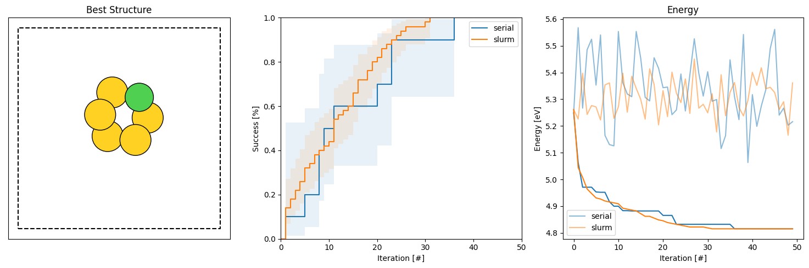

Getting started: Slurm
================================

Rather than running many runs serially we would like to do so in parallel, here by using the Slurm workload manager
commonly used on computing clusters. 

The script is changed to take the 'run_idx' variable as an input argument rather than as the iteration variable

.. literalinclude:: rss_script_slurm.py

This can be combined with a slurm submission script, that on, the system we have access to, can look like so 

.. literalinclude:: submission.sh

This creates a seperate folder for each independent run, as they may generally produce a lot of files that will 
clutter the work space. It also moves the script to a scratch disk, which is not really necessary for this example, but 
for others it may be. In the end it copies the files back to the created folders and moves the databases files out to the 
directory where the job was submitted. 

This particular script submitted 50 runs of the algorithm, and we may again use the batch analysis program to analyze the 
runs. Here in folders called serial and slurm

.. code-block:: console

   agox-analysis -d serial slurm -e -hg -dE 0.005

Which creates a figure like this one

Due to the higher number of independent search runs the resolution of the reported statistics is higher, which 
we can see in the small steps on the success curve and a smoother curve for the average energy of the best structure found at that 
iteration (deeper colors). 

