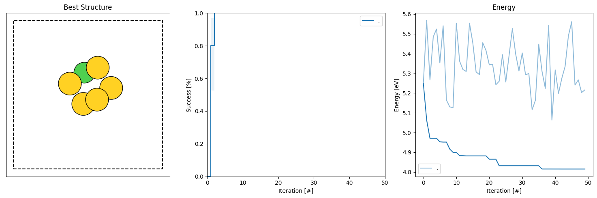
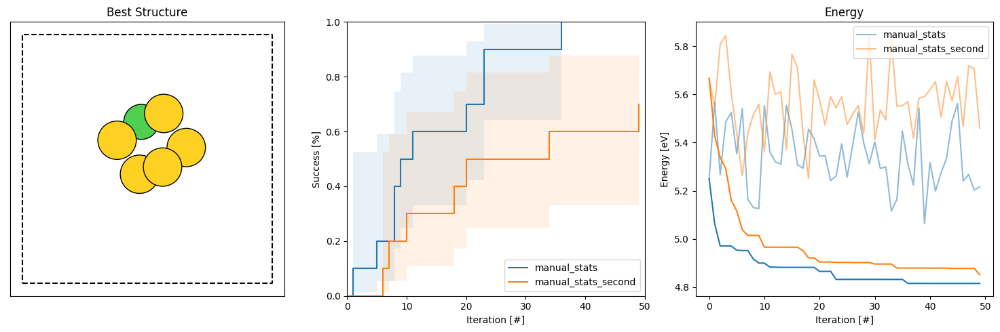

Getting started: Multiple runs
================================

Normally we are not interested in just the output of a single run, we want to run multiple independent runs of the same script.
This gives us more results and the ability to gauge how well the algorithm has performed on the problem which informs how 
confident we should be in the solutions that it finds. 

The simplest way of running multiple restarts is a for-loop, the script below is a slightly altered version of the one from 
the previous section. 

.. literalinclude:: rss_script_serial.py

We can run this script in exactly the same way, preferably in an empty directory

.. code-block:: console

   python rss_script_serial.py

It will now take a while longer and after it finishes 10 '.db' files have been produced. 

We may analyze these by running 

.. code-block:: console

   agox-analysis -d . -e -hg -dE 0.005

Which now produces a figure like this one: 

Where we now also show the success curve with the criteria specified by the '-dE' argument. 

We can compare two different sets of searches of the same system by giving both directories to the batch_analysis program 

.. code-block:: console

   python $AGOX_DIR/utils/batch_analysis.py -d small_gold_serial_1 small_gold_serial_2 -e -hg -dE 0.005

Which now has two sets of curves for both the success and the energy. The second one is a slightly altered version 
of the above script where the maximum allowed number of relaxations steps has been reduced from 400 to 50, which means 
that fewer of the initial candidates are able to relax into the GM structure with sufficiently low energy - making the algorithm 
less capable of solving the problem. This is evidenced by smaller slope of the success curve. 

.. note:: 

   The search runs can be made completely reproducible by using the 'seed' argument in the initialization of the 
   AGOX object. If we want to make a set of runs reproducible we can set the seed to the iteration variable::

   agox = AGOX(random_generator, database, evaluator, seed=run_idx)

