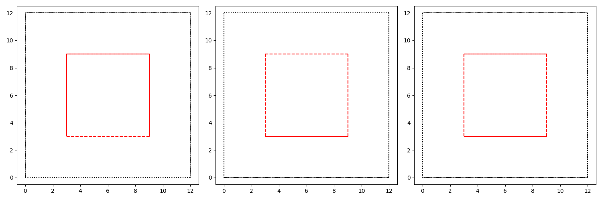

Getting started: Understanding the script
==========================================

Having run an AGOX search it is instructive to understand how the scripts used defined a search problem,
an algorithm to solve to it and executed the search.

The first interesting bit is the definition of the search problem, which is handled by the Environment module. 
The template is an ASE atoms object that may include any already present atoms, and the computational cell. 
The search may be, and generally should be, confined to a smaller volume than the full cell, this handled by 
the confinement cell and confinement corner. The confinement cell is specified by three vectors, like the computational cell, 
and the confinement corner is an offset relative to the origin of the computational cell. The symbols argument defines 
which atoms and how many atoms the search algorithm will control. 

.. literalinclude:: rss_script_slurm.py    
    :language: python
    :lines: 30-34

The script will generate a figure that shows the template, computational cell and confinement cell as viewed in the xy, xz and 
yz orientations. Given that the template is empty this is not too interesting in this case, but for more complicated system 
it is a very good idea to make certain the these settings are correct! 
In this case the cell is a square box and the confinement cell is a smaller square box at the center of the cell. 

Next a database is defined, this takes a file name and an (optional) argument called the order. The order is a central 
argument to AGOX modules and will be given to many modules. It specifies when in an iteration the module be called, 
i.e. it is used decide the order of execution of modules. Here the database module is given an order of 3. 

.. literalinclude:: rss_script_slurm.py    
    :language: python
    :lines: 37-38

Generators are an essential module, as they are responsible for generating candidate structures, an element that is 
present in all global optimization algorithms. In this case a conceptually simple generator is used, dubbed a Random 
Generator, it places atoms at random within the confinement cell only checking that bond-lengths are within an acceptable 
range based on the species involved. The generator is given this information from the Environment. This module is 
also given the order argument, but now with a value of 1, having a lower order than the database this modules actions 
will be execute before the database that had an order of 3. 

.. literalinclude:: rss_script_slurm.py    
    :language: python
    :lines: 44-45

The final module defined in the script is an evaluator, in this case a Local Optimization Evaluator, that as the name
suggests performs a local optimization on the generated candidate. This is given the ASE calculator that defines the potential 
and some arguments related to the local optimization which is handled by ASE. The gets argument is another 
central argument of AGOX, which defines where the module attempts to find the data it will act on - more on that in another 
section. Finally the order of the module is set to 2. 

.. literalinclude:: rss_script_slurm.py    
    :language: python
    :lines: 47-49

Having defined all the modules required for a random-structure search type search we pass the modules to AGOX. 
We give the random generator, the evaluator and the database - note that the order they are parsed to AGOX is not important 
and neither is the number of arguments given. 

.. literalinclude:: rss_script_slurm.py    
    :language: python
    :lines: 55

And run for a specified number of iterations

.. literalinclude:: rss_script_slurm.py    
    :language: python
    :lines: 57

When executing the script the first bit of output looks like so::

    |========================== Initialization starting ==========================|
    |================================= Observers =================================|
    |   Order 1 - Name: RandomGenerator.generate                                  |
    |   Order 2 - Name: LocalOptimizationEvaluator.evaluate_candidates            |
    |   Order 3 - Name: Database.store_in_database                                |
    |   Order 4 - Name: Logger.report_logs                                        |

The first box lists the observers, that is the modules that will be executed each iteration, in the order 
specified by the order attribute. So each iteration the script will call the RandomGenerator, then the 
LocalOptimizationEvaluator and finally the database. AGOX automatically adds an additional observer, the Logger, 
that times the each module. 

A second box, has information about the connection between modules::

    |========================= Observers set/get reports =========================|
    |   RandomGenerator.generate                                                  |
    |       Sets 'candidates'                                                     |
    |   LocalOptimizationEvaluator.evaluate_candidates                            |
    |       Gets 'candidates'                                                     |
    |       Sets 'evaluated_candidates'                                           |
    |   Database.store_in_database                                                |
    |       Gets 'evaluated_candidates'                                           |
    |   Logger.report_logs                                                        |
    |       Doesnt set/get anything                                               |
    |                                                                             |
    |   Overall:                                                                  |
    |   Get keys: {'evaluated_candidates', 'candidates'}                          |
    |   Set keys: {'evaluated_candidates', 'candidates'}                          |
    |   Key match: True                                                           |
    |========================== Initialization finished ==========================|

Behind the scenes the modules communicate through a shared 'cache', using keys to 
either get or set data. In this case the RandomGenerator sets its generated 
candidate with the key 'candidates', the LocalOptimizationEvaluator gets that 
candidate and sets its results with the key 'evaluated_candidates' which the Database 
finally gets from and stores. 

In each iteration the script will also yield some output, which looks something like this:: 

    |=============================== Iteration: 1 ================================|
    |================================= Database ==================================|
    | Energy 000001: 4.991662730050624                                            |
    |================================== Logger ===================================|
    | Total time 00.36 s                                                          |
    |  RandomGenerator.generate - 00.01 s                                         |
    |  LocalOptimizationEvaluator.evaluate_candidates - 00.35 s                   |
    |  Database.store_in_database - 00.00 s                                       |
    |============================ Iteration finished =============================|

The printing is done in the order of execution, but as the generator and evaluator dont 
give any output the first we see is the database reporting the energy of the candidate that 
it has stored. The logger then reports on the timing of each module, which also shows that 
the modules are indeed being executed in the specified and expected order. 

