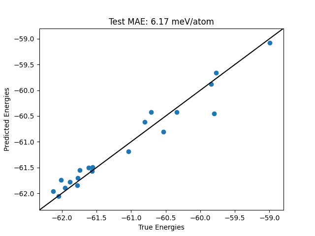

Local Gaussian Process Regression
==================================
To train the local GPR model on a training dataset, we have to gather the training data as a
list of ASE Atoms objects or AGOX Candidate objects. Then setup the model and kernel including
selection of hyperparameters and finally run the training.

Varius ways to sparsify the model exist in the AGOX code. In this example we will use the
CUR sparsification throughout.

Below we will train a local GPR model on a silver-oxide dataset and save the model.

.. literalinclude:: scripts/lgpr_train.py

We can either use the model directly or in a seperate script we can now load the model and use
it for predictions. Below is shown how a model a loaded and a test dataset parity plot is made
to investigate prediction quality.

.. literalinclude:: scripts/lgpr_load.py

This should result in the following figure

.. note::
   If a model should be actively trained during an AGOX run, then the model needs to be attached to a database.

